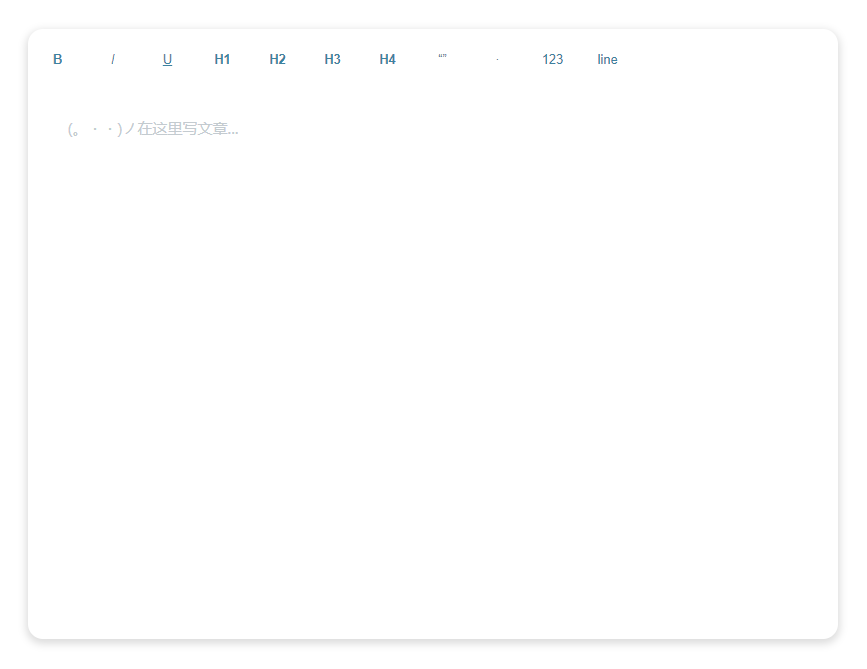

<div align=center>

</div>


  


# Penlf 富文本编辑器📜

  


A simple rich text editor. 一个简单的富文本编辑器。📑📌

> Penlf.js 的体积仅仅只有 7KB！✨

  

  





  


## 用法🔨

```js
// 引入js
<script type="text/javascript" src="./dist/Penlf.js"></script>


<script>
        // 自定义保存 (save)
        let save = (content) => {
            console.log(content); // 输入的内容（html形式）
            console.log("saved your content.");
        }

        // 初始化 (init)，第一个参数对应你的网页dom
        // 注意，目前版本请在任何时候不要将任何元素的id和class设置为editor
        let info = window.editor("#demo", save)
        document.querySelector("#version-num").innerHTML = info.version
</script>
```


您也可以查看 [example.html](./example.html) 这个例子，了解如何使用。


  


## 快捷键🔮

| 快捷键   | 功能   |
| -------- | ------ |
| Ctrl + B | 加粗   |
| Ctrl + I | 斜体   |
| Ctrl + U | 下划线 |
| Ctrl + S | 保存   |


  


## 自定义功能📝

你可以通过下面的方式，添加你自定义的功能，并且显示在工具栏当中

``` js
window.editor(element, saveHandler, moreActions)

moreActions = [
    {
        name: "photo",
        icon: "photo",
        title: "图片上传",
        type: 'file',
        result: () => {
            // 点击事件触发后的处理函数
        },
        init:(editor, action, actionsBar) => {
            // 此处初始化你自定义的功能，此函数仅在加载编辑器的时候调用一次，用于初始化样式和相关内容
            // editor：编辑器dom
            // action: moreActions数组的当前元素
            // actionsBar:工具栏dom
        }
     }
]
```


  


## 许可证🧾

MIT License

Copyright (c) 2021 Ming

Permission is hereby granted, free of charge, to any person obtaining a copy
of this software and associated documentation files (the "Software"), to deal
in the Software without restriction, including without limitation the rights
to use, copy, modify, merge, publish, distribute, sublicense, and/or sell
copies of the Software, and to permit persons to whom the Software is
furnished to do so, subject to the following conditions:

The above copyright notice and this permission notice shall be included in all
copies or substantial portions of the Software.

THE SOFTWARE IS PROVIDED "AS IS", WITHOUT WARRANTY OF ANY KIND, EXPRESS OR
IMPLIED, INCLUDING BUT NOT LIMITED TO THE WARRANTIES OF MERCHANTABILITY,
FITNESS FOR A PARTICULAR PURPOSE AND NONINFRINGEMENT. IN NO EVENT SHALL THE
AUTHORS OR COPYRIGHT HOLDERS BE LIABLE FOR ANY CLAIM, DAMAGES OR OTHER
LIABILITY, WHETHER IN AN ACTION OF CONTRACT, TORT OR OTHERWISE, ARISING FROM,
OUT OF OR IN CONNECTION WITH THE SOFTWARE OR THE USE OR OTHER DEALINGS IN THE
SOFTWARE.


  

  

