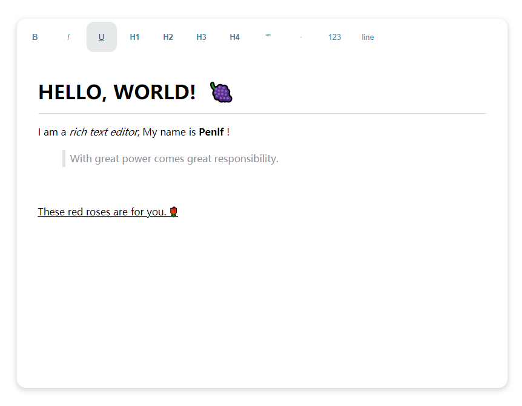

<div align=center>

</div>


  


# Penlf 富文本编辑器📜

  


A simple rich text editor. 一个简单的富文本编辑器。📑📌

> Penlf.js 的体积仅仅只有 7KB！✨

  

  


  


## 用法🔨

```js
// 引入js
<script type="text/javascript" src="./dist/Penlf.js"></script>


<script>
        // 自定义保存 (save)
        let save = (content) => {
            console.log(content); // 输入的内容（html形式）
            console.log("saved your content.");
        }

        // 初始化 (init)，第一个参数对应你的网页dom
        // 注意，目前版本请在任何时候不要将任何元素的id和class设置为editor
        let info = window.editor("#demo", save)
        document.querySelector("#version-num").innerHTML = info.version
</script>
```


您也可以查看 [example.html](./example.html) 这个例子，了解如何使用。


  


## 快捷键🔮

| 快捷键   | 功能   |
| -------- | ------ |
| Ctrl + B | 加粗   |
| Ctrl + I | 斜体   |
| Ctrl + U | 下划线 |
| Ctrl + S | 保存   |


  


## 自定义功能📝

你可以通过下面的方式，添加你自定义的功能，并且显示在工具栏当中

``` js
window.editor(element, saveHandler, moreActions)

moreActions = [
    {
        name: "photo",
        icon: "photo",
        title: "图片上传",
        type: 'file',
        result: () => {
            // 点击事件触发后的处理函数
        },
        init:(editor, action, actionsBar) => {
            // 此处初始化你自定义的功能，此函数仅在加载编辑器的时候调用一次，用于初始化样式和相关内容
            // editor：编辑器dom
            // action: moreActions数组的当前元素
            // actionsBar:工具栏dom
        }
     }
]
```


  


## 许可证🧾

MIT License

Copyright (c) 2021 Ming


  

  

